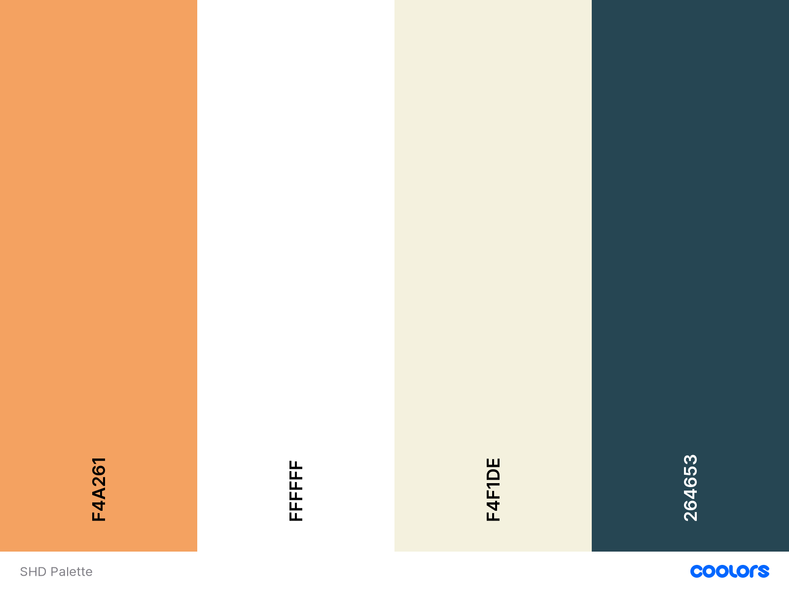

# Sexual Health Dublin Website


Thank you for taking the time to come visit my project! I welcome any comments, questions, 
and suggestions, and can be reached with my GitHub contact details.

## Contents
  * [UX User Experience](#ux-user-experience)
    + [Project Goals](#project-goals)
  * [User Requirements and Expectations](#user-requirements-and-expectations)
      - [Requirements](#requirements)
      - [Expectations](#expectations)
  * [Design Choices](#design-choices)
      - [Fonts](#fonts)
      - [Icons](#icons)
      - [Colors](#colors)
      - [Background](#background)
    + [Wireframes](#wireframes)
  * [Features](#features)
  * [Technologies Used](#technologies-used)
    + [Languages](#languages)
    + [Tools and Libraries](#tools-and-libraries)
  * [Testing](#testing)
      - [Test Planning](#test-planning)
      - [Testing Stories](#testing-stories)
    + [Overall](#overall)
    + [Features](#features-1)
  * [Bugs](#bugs)
      - [Bugs During Development](#bugs-during-development)
      - [Known Bugs](#known-bugs)
  * [Deployment](#deployment)
      - [Running Sexual Health Dublin Locally](#running-sexual-health-dublin-locally)
  * [Closing Notes](#closing-notes)
  * [Credits](#credits)

Sexual Health Dublin is a spot where people looking for assistance with their sexual health 
can seek out information on clinics and other supports in the Dublin area.

## UX User Experience
### Project Goals
The goal of this project is to provide users with infromation pertaining to their sexual health,
and to give them a way to ask for the help that they need, which can be difficult for many. 
It is aimed at people living in the Dublin area. The finished site will be clean and simple 
enough to be easily accessible, with usability as the top priority - there are currently other 
sites like this one in use, but they are cluttered and sometimes difficult to navigate.

#### User Goals
* Easy communication with professionals at SHD through a contact form.
* Ability to fill out and submit questionnaire.
* Ability to browse service locations.
* Responsiveness to different devices.

#### User Stories:
* As a user I expect to be able to contact professionals at SHD for assistance.
* As a user I expect to be able to fill out and submit the SHD questionnaire.
* As a user I expect to be able to browse services by location.

#### Site Owner Goals
* Provide information to users about various sexual health services.
* Provide users with the ability to contact us for further information.

## User Requirements and Expectations
##### Requirements
* Navigate the site using the navbar.
* Be provided with an accurate, up to date map.
* Be able to browse services by location via map.
* Be able to fill out and submit questionnaire.
* Be able to contact the SHD office.
* Website is displayed appealingly.

##### Expectations
* Can tap/click on navbar links to direct around the site.
* Map is up to date.
* Contact form is functional.
* Questionnaire is easy to fill out and submit.
* Navbar condenses to drop down menu in mobile/tablet view.
* Website is appealing and provides accurate information.

## Design Choices

The color palette for this site is inspired by colors I saw being used frequently on other
medical websites. The [Coolers](coolers.co) palette I created can be found
[here](https://coolors.co/f4a261-ffffff-f4f1de-264653).

##### Fonts

The two fonts I used for this site are [Open Sans](https://fonts.google.com/specimen/Open+Sans) 
and [Roboto](https://fonts.google.com/specimen/Roboto). I chose these two because I found after cursory
research that in 2020, Open Sans was the top used font on hospital websites, according to 
[ilovewp.com](https://www.ilovewp.com/resources/medical/wordpress-for-hospitals/most-used-google-fonts-on-hospital-websites/).
I then chose Roboto because it was one of the top paired fonts on Google Fonts.

##### Icons

I chose to use only one icons: a hamburger icon that serves as a drop-down navbar menu on mobile devices and tablets.
This icon is widely recognizable because of the regularity of its use.

##### Colors

As mentioned just under the Design Choices header, the 
[color palette](https://coolors.co/f4a261-ffffff-f4f1de-264653) I used was from 
[Coolors.co](coolors.co). 



* .background, .button-hover, & .link-color:hover: #FFF **“White”** This is the background color for the site, and also the pseudo-class color
that is invoked when the user clicks or hovers over a button. I chose white because it is easy and calm,
and in an attempt to follow the pattern of many other medical websites.
* .charcoal: #264653 **“Charcoal”** I chose this color for the navbar and footer, and for the body text on
the page because it bounces off the white well but not so harshly as black, because it works well with the
hero image, and because it in the same family of colors I saw on many other medical websites.
* .eggshell: #F4F1DE **“Eggshell”** Eggshell was decided upon for text that appears over charcoal backgrounds
and over the image because it bounces off the dark color well but is still soft. It also reads better over the image
than white did.
* .sandybrown: #F4A261 **"Sandy Brown"** I selected Sandy Brown because it is alert enough for a button, but is still
softer than using a marigold or bright red color. It also works well with Charcoal and with the hero image.

##### Background

The [hero image](../images/dublin.jpg) was selected because it was available for use without broaching usage rights, 
and is a photograph of Dublin. I found the image 
[here](https://sharpmagazine.com/2015/12/22/the-travelling-man-dublin-ireland/).

### Wireframes 

I used [Balsamiq](https://balsamiq.com/) to build this project’s wireframe. You can view them [here](wireframes/wireframesSHD.pdf).

## Features

* Site-wide consistent navbar and footer
* Contact button with modal form
* Questionnaire button with modal form
* Interactive map with markers and marker clusters

## Technologies Used

### Languages
* [HTML](https://developer.mozilla.org/en-US/docs/Web/HTML)
* [CSS](https://developer.mozilla.org/en-US/docs/Web/CSS)
* [JS](https://www.popper.JS.org/)

### Tools and Libraries
* [Bootstrap](https://getbootstrap.com)
* [Favicon](https://favicon.io/)
* [Font-Awesome](https://fontawesome.com/icons?d=gallery)
* [Git](https://git-scm.com/)
* [Google Maps API](https://developers.google.com/maps/documentation/javascript/overview)
* [Google Fonts](https://fonts.google.com/)
* [jQuery](https://jquery.com/)

## Testing

Working to follow the methodology displayed in the course, I wanted to make sure that 
I was thurough in my testing. Thankfully, I was able to accomplish this with the help 
of the Slack community and my incredibly helpful mentor, Simen. 

##### Test Planning

Before I made this site, I created a set of wireframes. Early building showed me that what I was
hoping to create - a website with multiple separate maps on one page - was highly advanced, so I
scraped that site, reworked my wireframes, and got back to work on the site you have in front of you.
I tested bits and bobs as I went through the creation process.

##### Testing Stories

* Originally, I wanted to put multiple maps on the page dedicated to specific services - HIV/AIDS screening,
LGBTQIA+ friendly services, pregnancy services, etc. - however, as stated above, this didn't work out, so I 
combined the maps into one. Further research showed me that one map would be more appropriate, as the amount
of services in Dublin are lacking.

* As I added markers to the map, I kept an eye on where the clusters turned out. If there were areas that 
were lacking any locations, I did extra work to find services in those areas. As there is no conclusive 
database with these locations that I could find, this proved a bit difficult, but was rewarding. I did
bend a little bit to include doctor's offices that were general practice, but advertise sexual health services
in order to do this.

* My original plan included only one modal, which was called when the user clicks on the questionnaire button.
However, I liked it so much and decided that adding a modal for contact would be helpful to the user, and 
would help me with practicing my coding abilities!

* While I originally used a jumbotron for the hero section of this website as I did with my MS1, I opted to 
not repeat that. I decided that for this site, a regular div looked much nicer and cleaner, and proved less
frustrating re: centering the hero text.

### Overall

**Responsiveness**
* **Plan**: Following the principle of mobile-first design, I knew my websited needed to be entirely responsive. 
To do this, I used a Bootstrap framework, and constantly referred back to dev tools to keep an eye on things.
* **Implementation**: As I built my site, I regularly checked back in on dev tools, pushing the size around to 
make sure things stayed where they were meant to be.
* **Result**: After regular testing, the site is fully responsive.
* **Verdict**: The site is responsive! The test passes.

**Design**
* **Plan**: I wanted my site to be crisp and comforting - seeking sexual health services can be terribly
daunting, so information presented in a calm but also clear way was vital to me. I also wanted to follow 
the conventions of other healthcare sites - soft, bold colors over white backgrounds, and plain text.
* **Implementation**: Selecting colors and fonts that follow these requirements and conventions. 
* **Result**: The color palette and fonts I chose work well.
* **Verdict**: Because these work well well, this test passes!

### Features

**Navbar and Footer**
* **Plan**: In the planning phase, I decided that I wanted the navbar to be fixed and for the links to shrink 
into a dropdown menu for mobile and tablet screens. This would make the use of the navbar more feasible for users
on mobile and tablets. I wanted the footer to only be visible when the user scrolls to the 
bottom of the page, and for it to have a link to the creator's (my) github page, with a copyright. This doesn't 
seem like the sort of service that would very much benefit from other social media platforms, which is why I didn't 
create little link icons like in my MS1.
* **Implementation**: I used Bootstrap to build the navbar and footer.
* **Result**: The navbar and footer are both positioned where I want them and are fully responsive, with links functioning.
* **Verdict**: Because of the results, the test passes!


**Contact Us Modal, Button and Form**
* **Plan**: I wanted the contact us button in the navbar to provide the user with a modal when clicked, and for the form
to allow the user to input their name, email address, and a message. I wanted the button they would click to submit 
to display a message confirming their submission.
* **Implementation**: I used Bootstrap and some jQuery to make this happen, along with assistance from Simen and a very
patient tutor.
* **Result**: The Contact Us modal, button and form all work as intended and are easy to navigate.
* **Verdict**: Because of the results, this test passes!

**Questionnaire Button with Modal and Form**
* **Plan**: At the start, I wanted the modal to hold a Google Doc - however, this looked less smooth than I had imagined,
so I decided a regular bootstrap form would be better. It still achieved the goal - have a questionnaire button that returned
a modal with a form to the user that they could fill out and submit. Similar to the contact us submission button, I wanted
the submit button to display a message of confirmation.
* **Implementation**: As with the contact modal, I used Bootstrap and some jQuery.
* **Result**: While the end result differs from the original plan, I am quite happy with the result -
 it is clean, responsive, and easy to fill out.
* **Verdict**: Because of the results, this test passes!

**Interactive Map with Markers and Marker Clusters**
* **Plan**: As alluded to earlier, I originally intended for this site to be made up of multiple maps, each displaying markers
for different types of services. However, I am more pleased with the end result than I think I would've been with the multiple maps,
as this looks cleaner and unified. I hand-entered the different map markers, selecting as many sexual healthcare services as I could find.
* **Implementation** : I used Google Maps API to implement this.
* **Result**: The map is perfect! I like how it sits on the page, it is responsive, and the map markers and marker clusters are smooth.
* **Verdict**: Because of the results, this test passes!

## Bugs
#### Bugs During Development

Over the process of creating this site, I ran into a few bugs, but thankfully between Simen, Slack, and the tutors, 
I sorted these out! Here are a few examples:

**Map disappearing**
* Bug: After I added in all of the marker locations, the map disappeared!
* Fix: Some digging showed me how to fix this - Google Maps API reqires one last comma in the string of locations,
which I had missed. 
* Verdict: Popped the comma on the end, and the map reappeared with all the markers in tact!

**Home navbar link not functioning** 
* Bug: When clicked on, the home link in the navbar didn't function.
* Fix: Updating the href.
* Verdict: I had changed the corresponding div ID and forgotten to update it in the navbar a tag!

**Questionnaire submit button not displaying text correctly** 
* Bug: When clicked on, the button either didn't display text but didn't reboot the page, or it displayed the text
but rebooted the page automatically.
* Fix: Removing a misplaced semicolon.
* Verdict: Once I took out a misplaced semicolon, it worked like a charm!

#### Known Bugs

Sometimes, when in dev tools the site works smoothly. Other times, the screen doesn't automatically fit, 
and there is a horizontal scroll. I ran into this issue with my MS1, and think it may just be ... one of those things.

## Deployment

Sexual Health Dublin was developed in GitPod, hosted by GitHub and using git.

The following steps were followed to deploy Sexual Health Check Online through GitHub Pages:

* Loaded **GitHub** in Chrome web browser.
* Signed into GitHub.
* Clicked on my **repositories**.
* Navigated to **'mcalistm/SexualHealthDublin'**.
* Selected **'settings'**.
* Navigated to the **GitHub Pages** area of the page. 
* Selected **'Master Branch'** from the **'Source'** dropdown menu.
* Confirmed my selection.
* Sexual Health Check Online is now live on GitHub Pages.

#### Running Sexual Health Dublin Online Locally

Cloning Sexual Health Check Online from GitHub:
* Navigate your screen to **/mcalistm/SexualHealthDublin**.
* Click on the green **Copy** button.
* Copy the provided URL.
* Start up the terminal of your choice with the IDE of your choice.
* Navigate to the file location of your choice.
* To clone, copy this code and input it into your terminal: 

```
https://github.com/mcalistm/SexualHealthDublin.git
```

## Closing Notes

This project has helped me work on my skills from my MS1, as well as build my skills from the most recent
modules. It has also helped me with asking for help when I need it, and knowing where I need to look for answers.
While challenging, this project also increased my self confidence in the area. I look forward to continuing
to build my skills in front-end development, and to learning about back-end development in the upcoming modules! 

## Credits
* [My MS1 Project](https://mcalistm.github.io/NightValeCommunityRadio/)
* [Simen Daehlin](https://github.com/Eventyret)
* Code Institute Slack Community
* Code Institute Tutors
* [George Pyott](https://github.com/Geomint)'s Holiday Destinations
[README.md file](https://github.com/Geomint/holiday-destinations/blob/master/README.md),
shown to me by Simen.
* [Get Lat Long from Address](https://www.latlong.net/convert-address-to-lat-long.html)